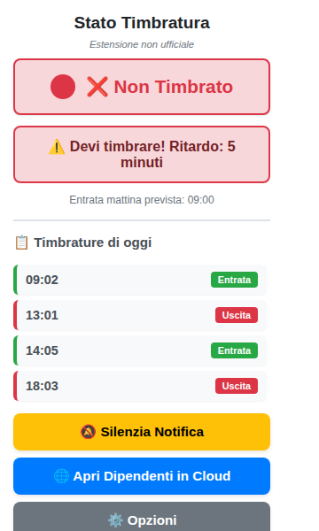
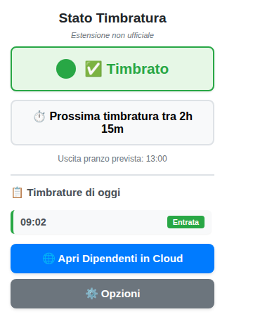
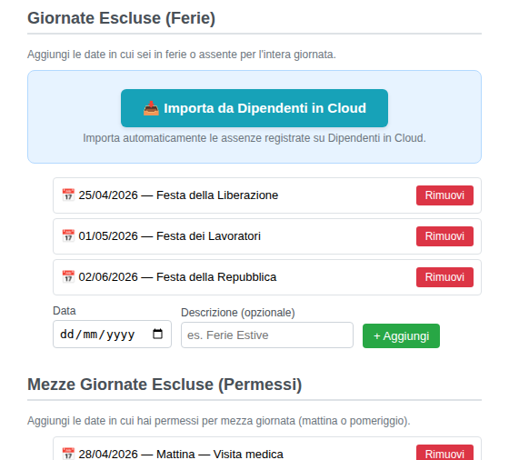
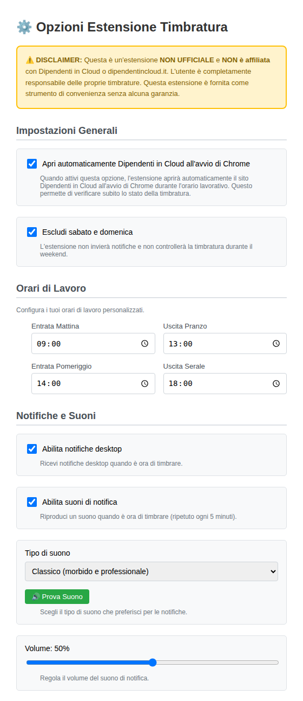

# Promemoria Timbrature

> **English** | [Italiano](README.it.md)
>
> [Contributing](CONTRIBUTING.md) | [Security](SECURITY.md) | [Changelog](CHANGELOG.md)

 

A Chrome extension that reminds you to clock in and out on [dipendentincloud.it](https://www.dipendentincloud.it).

## Disclaimer

This extension is **not official** and is **not affiliated** with Dipendenti in Cloud or dipendentincloud.it in any way.

The user is **solely responsible** for their own clock-in/out records. This extension is provided as a convenience tool with no warranty of any kind. It does not replace the need to verify your records directly on the platform.

## What It Does

Dipendenti in Cloud is a platform used by companies in Italy to manage employee attendance, payroll documents, and communications. Employees clock in and out through the web interface, and forgetting to do so is a common source of payroll issues.

This extension monitors your clock status on dipendentincloud.it and alerts you when it is time to punch in or out, using visual cues, desktop notifications, and configurable sounds. It runs entirely in your browser with zero external dependencies and sends no data anywhere.

## Installation

This extension is not published on the Chrome Web Store. To install it, load it manually in developer mode:

1. Download or clone this repository.
2. Open Chrome and navigate to `chrome://extensions/`.
3. Enable **Developer mode** (toggle in the top-right corner).
4. Click **Load unpacked** and select the root folder of this repository.
5. Visit [secure.dipendentincloud.it](https://secure.dipendentincloud.it) and log in. The extension activates automatically.

To update, pull the latest changes and click the reload button on the extension card in `chrome://extensions/`.

## How It Works

### Icon States

The extension icon in the Chrome toolbar reflects your current status at a glance:

| Icon color       | Meaning                                     |
| ---------------- | ------------------------------------------- |
| **Green**        | You are clocked in. No action needed.       |
| **Red**          | You are not clocked in.                     |
| **Blinking red** | You need to clock in or out now.            |
| **Gray**         | Status unknown (visit the site to refresh). |

A **badge** on the icon shows a countdown (in minutes or hours) to the next expected clock event.

### Popup

Click the extension icon to open the popup, which displays:

- Current clock status (in/out/unknown).
- Detailed countdown to the next clock event, with urgency indicators.
- Today's complete punch history with timestamps.
- A button to open Dipendenti in Cloud directly.
- A mute button to silence the current notification cycle.

### Notifications

When it is time to clock in or out, the extension sends:

- **Desktop notifications** via the Chrome notification system.
- **Audio alerts** synthesized in real time using the Web Audio API (no external audio files). Six sound profiles are available, each designed for a different environment.

Notifications repeat every few minutes until you take action or mute them.

### Sound Profiles

All sounds are generated locally via the Web Audio API. No audio files are downloaded or bundled.

| Sound   | Character                                        | Best for                         |
| ------- | ------------------------------------------------ | -------------------------------- |
| Classic | Three soft ascending tones, professional         | Shared offices, daily use        |
| Gentle  | Two overlapping tones, very quiet (30% reduced)  | Silent environments, open spaces |
| Bell    | Natural harmonics, familiar smartphone-like ring | Home office, remote work         |
| Digital | Fast four-tone sequence, modern                  | Tech environments, startups      |
| Urgent  | Sharp square-wave sequence, hard to miss         | Noisy environments               |
| Alarm   | Alternating siren effect, impossible to ignore   | Maximum alert (use with caution) |

**Volume** is adjustable from 0% to 100%. Recommended ranges: 30-40% for shared offices, 50-60% for home office, 70-80% for noisy environments.

## Configuration

Right-click the extension icon and select **Options**, or click the Options link in the popup.

### Work Schedule

Set your personal schedule. The extension uses these times to determine when to send reminders:

- Morning start (default: 09:00)
- Lunch break (default: 13:00)
- Afternoon start (default: 14:00)
- Evening end (default: 18:00)

### Exclusions

Prevent notifications on days you are not working:

- **Weekend exclusion** -- disables all alerts on Saturdays and Sundays.
- **Full-day exclusions** -- add specific dates (holidays, PTO) with optional descriptions.
- **Half-day exclusions** -- mark a morning or afternoon as off (e.g., a medical appointment).
- **Auto-import** -- import upcoming absences directly from the Dipendenti in Cloud dashboard (next 7 days).

### Notifications and Sound

- Enable or disable desktop notifications independently from sound alerts.
- Select a sound profile from the six options above.
- Adjust the volume and preview sounds before saving.

### General

- **Auto-open** -- automatically open Dipendenti in Cloud when Chrome starts during work hours (optional).

## Troubleshooting

**The extension does not detect my status.**
Visit dipendentincloud.it and make sure you are logged in. The extension needs at least one page load to read the current state.

**I do not hear any sound.**
Check that sound alerts are enabled in the options, the volume slider is above 0%, and your operating system volume is not muted. Chrome must also have audio permissions for the site.

**Notifications are too frequent.**
Use the mute button in the popup to silence the current cycle, or clock in/out to stop them entirely.

**The icon stays gray.**
This means the extension has not been able to determine your status. Reload the Dipendenti in Cloud page.

## Privacy and Security

- All data is stored locally in `chrome.storage.local`. Nothing is transmitted externally.
- The extension only reads publicly visible information from the dipendentincloud.it page. It does not access credentials, tokens, or personal data.
- No analytics, telemetry, or tracking of any kind.
- Zero runtime dependencies. No CDN, no external scripts.
- Content Security Policy: `default-src 'none'; script-src 'self'`.
- All message handlers validate the sender identity and origin before processing.
- DOM manipulation uses `textContent` and `createElement` exclusively -- never `innerHTML`.

For the full security design, see [SECURITY.md](SECURITY.md).

## Requirements

- Google Chrome 116+ or any Chromium-based browser (Edge, Brave, Opera, Vivaldi).
- An active account on dipendentincloud.it.

Permissions requested by the extension:

| Permission                           | Purpose                                                       |
| ------------------------------------ | ------------------------------------------------------------- |
| `storage`                            | Save your settings and clock status locally                   |
| `notifications`                      | Send desktop reminders                                        |
| `offscreen`                          | Play audio alerts in the background via Web Audio API         |
| `alarms`                             | Schedule periodic checks that survive service worker restarts |
| Host access to `dipendentincloud.it` | Read clock status from the page                               |

## Contributing

Contributions are welcome. See [CONTRIBUTING.md](CONTRIBUTING.md) for guidelines.

## License

This project is licensed under the [MIT License](LICENSE).

Copyright (c) 2024-2026 Andrea Bonacci.

---

If you find this extension useful, consider giving the repository a star. It helps others discover the project.

**Disclaimer:** This is an independent tool. Always verify your attendance records directly on Dipendenti in Cloud.

Developed by **Andrea Bonacci**.
