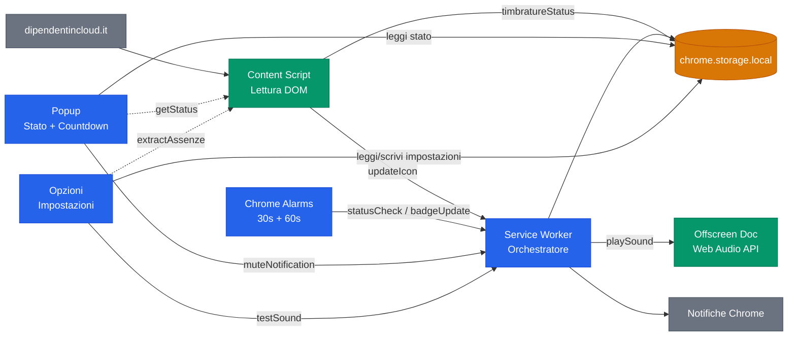
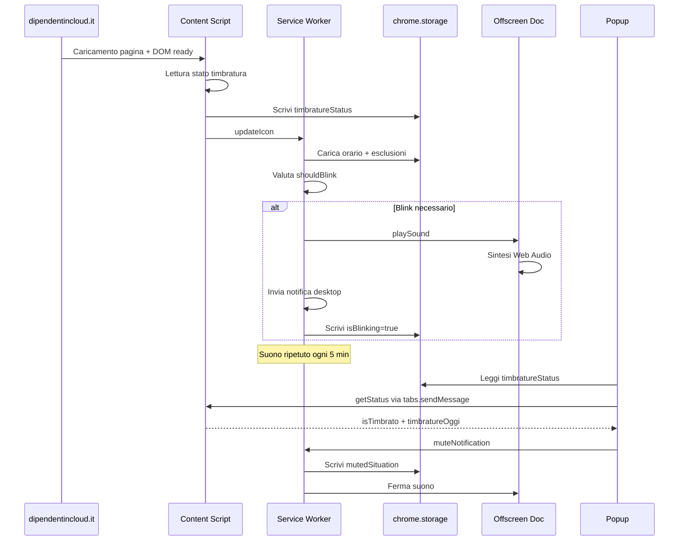
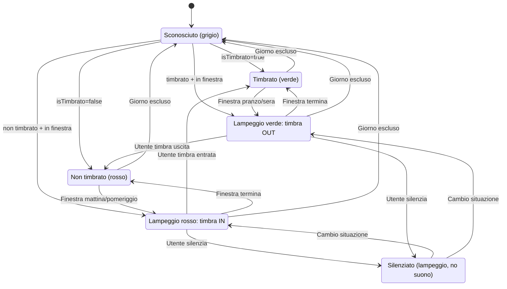
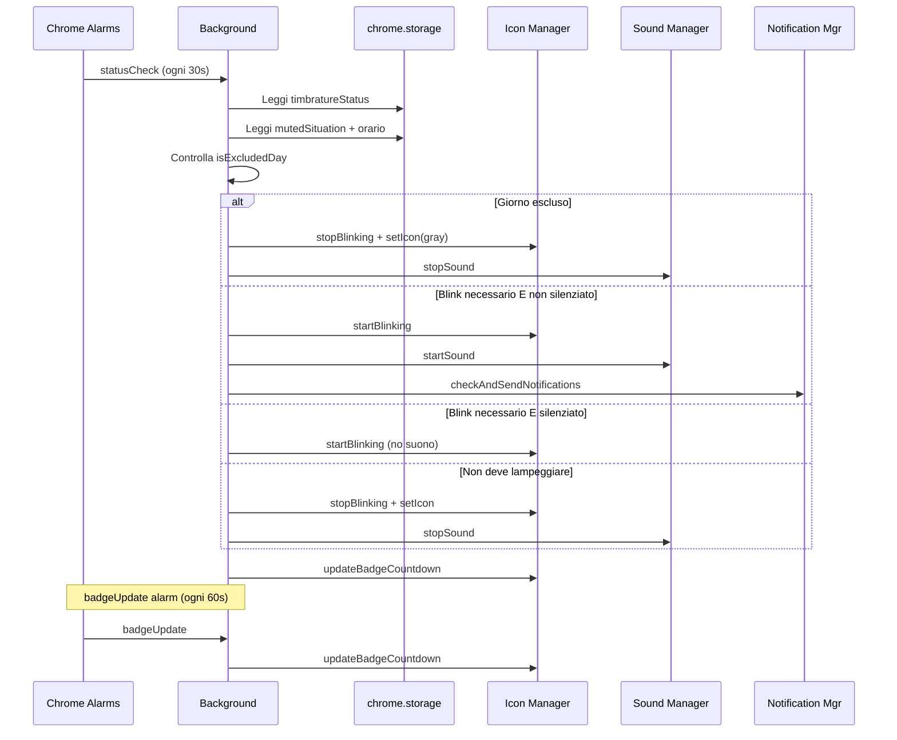

# Architettura

> [English](ARCHITECTURE.md)

Documentazione tecnica dell'architettura interna dell'estensione, flussi di messaggi e gestione dello stato.

## Panoramica Componenti

L'estensione opera in 5 contesti di esecuzione Chrome isolati, connessi tramite messaging `chrome.runtime`/`chrome.tabs` e `chrome.storage.local` come bus di stato condiviso.

**Legenda:** Blu = orchestrazione (service worker, alarms, pagine UI) | Verde = motori di esecuzione (content script, audio offscreen) | Arancione = stato condiviso (storage) | Grigio = esterni (sito, API Chrome)

**Frecce continue** = `chrome.runtime.sendMessage` o accesso diretto allo storage. **Frecce tratteggiate** = `chrome.tabs.sendMessage` (richiede tab attivo sull'origine target).

## Flusso Messaggi

Sequenza completa dal caricamento pagina all'attivazione del promemoria, poi interazione utente tramite popup.

Dettagli chiave:
- Il content script usa 3 strategie di rilevamento in ordine di priorita: testo pulsante, parita conteggio timbrature, classi CSS indicatori stato.
- Il `MutationObserver` ri-attiva il rilevamento alla navigazione SPA (debounce 500ms, intervallo minimo 10s).
- Il popup interroga il content script solo quando il tab attivo corrisponde a un'origine consentita.

## Macchina a Stati dell'Icona

L'icona dell'estensione riflette lo stato della timbratura e se serve un'azione. Sei stati, guidati dalla valutazione `shouldBlink()` in `time-utils.js`.

Le 4 condizioni di lampeggio corrispondono all'orario di lavoro:

| Finestra | Stato timbratura | Colore lampeggio | Significato |
|----------|-----------------|------------------|-------------|
| `morningStart` - `lunchEnd` | Non timbrato | Rosso | Devi timbrare l'entrata mattina |
| `lunchEnd` - `afternoonStart` | Timbrato | Verde | Devi timbrare l'uscita pranzo |
| `afternoonStart` - `eveningEnd` | Non timbrato | Rosso | Devi timbrare l'entrata pomeriggio |
| Dopo `eveningEnd` | Timbrato | Verde | Devi timbrare l'uscita sera |

**Silenzia** ferma il suono ma l'icona continua a lampeggiare. Quando la situazione cambia (confine dello slot orario successivo), il silenziamento si resetta automaticamente.

## Ciclo di Controllo Periodico

Due alarm Chrome mantengono lo stato coerente anche dopo riavvii del service worker (MV3 puo terminare il SW in qualsiasi momento).

L'alarm `statusCheck` (30s) e' il battito cardiaco: rilegge lo storage, rivaluta l'intero albero decisionale del blink, e riconcilia lo stato. Gestisce i casi in cui:
- Il service worker e' stato terminato e riavviato da Chrome
- L'utente ha timbrato in un altro tab
- Un confine orario e' stato superato tra un controllo e l'altro

L'alarm `badgeUpdate` (60s) e' piu leggero: aggiorna solo il testo del countdown nel badge.
