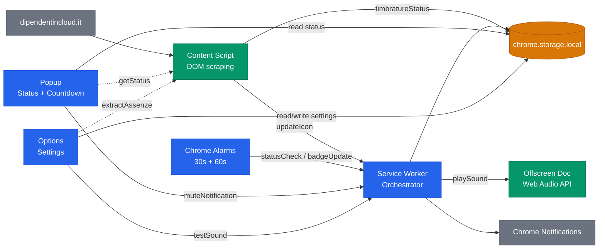
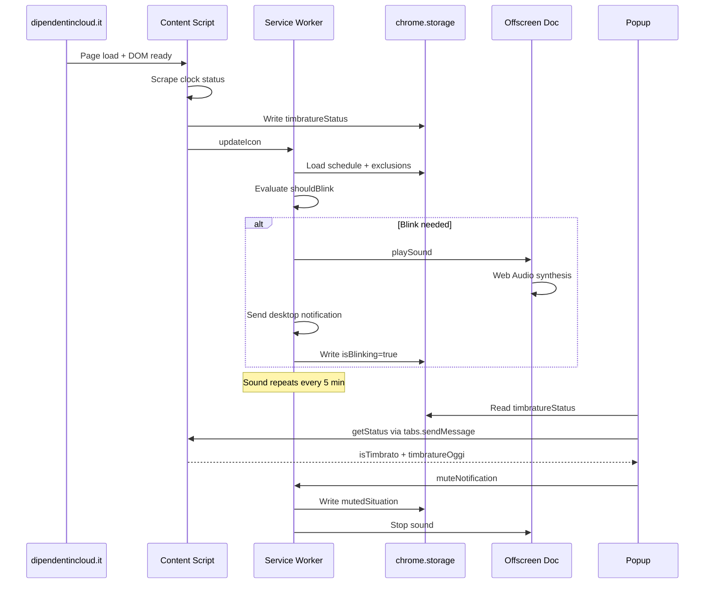
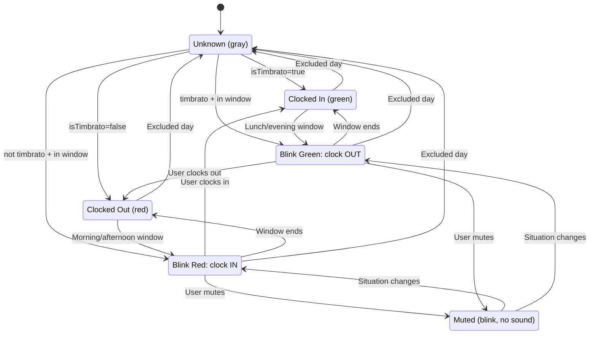
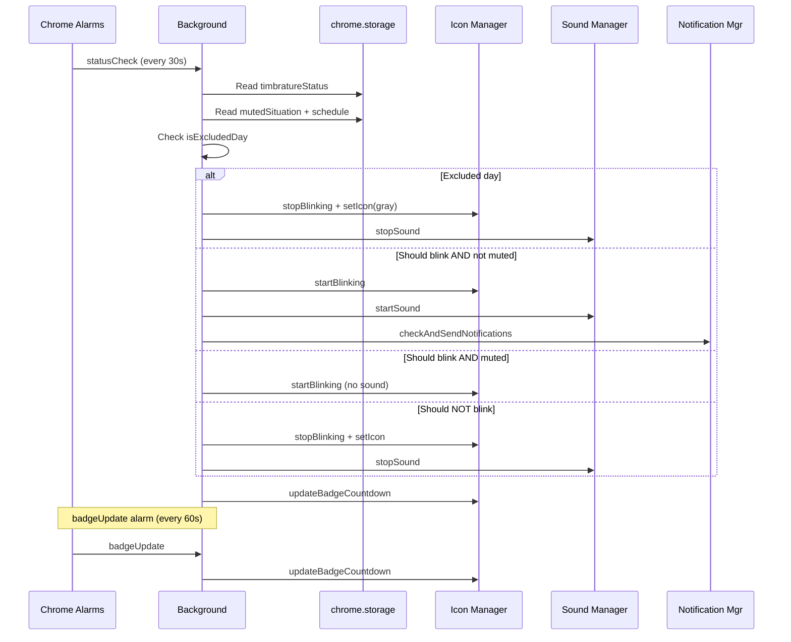

# Architecture

> [Italiano](ARCHITECTURE.it.md)

Technical documentation of the extension's internal architecture, message flows, and state management.

## Component Overview

The extension runs across 5 isolated Chrome execution contexts, connected via `chrome.runtime`/`chrome.tabs` messaging and `chrome.storage.local` as the shared state bus.

**Legend:** Blue = orchestration (service worker, alarms, UI pages) | Green = execution engines (content script, offscreen audio) | Orange = shared state (storage) | Gray = external (site, Chrome APIs)

**Solid arrows** = `chrome.runtime.sendMessage` or direct storage access. **Dashed arrows** = `chrome.tabs.sendMessage` (requires active tab on the target origin).

## Message Flow

Complete sequence from page load to reminder activation, then user interaction via popup.

Key details:
- Content script uses 3 detection strategies in priority order: button text, time-count parity, status-indicator CSS classes.
- The `MutationObserver` re-triggers detection on SPA navigation (debounced 500ms, min interval 10s).
- Popup queries content script only when the active tab matches an allowed origin.

## Icon State Machine

The extension icon reflects the user's clock status and whether action is needed. Six states, driven by `shouldBlink()` evaluation in `time-utils.js`.

The 4 blink conditions map to the work schedule:

| Window | Clock status | Blink color | Meaning |
|--------|-------------|-------------|---------|
| `morningStart` - `lunchEnd` | Not clocked in | Red | Need to clock in for morning |
| `lunchEnd` - `afternoonStart` | Clocked in | Green | Need to clock out for lunch |
| `afternoonStart` - `eveningEnd` | Not clocked in | Red | Need to clock in for afternoon |
| After `eveningEnd` | Clocked in | Green | Need to clock out for evening |

**Mute** silences sound but keeps the icon blinking. When the situation changes (next time slot boundary), mute resets automatically.

## Periodic Check Cycle

Two Chrome alarms keep the state consistent even across service worker restarts (MV3 can terminate the SW at any time).

The `statusCheck` alarm (30s) is the heartbeat: it re-reads storage, re-evaluates the full blink decision tree, and reconciles state. This handles cases where:
- The service worker was killed and restarted by Chrome
- The user clocked in/out on another tab
- A schedule boundary was crossed between checks

The `badgeUpdate` alarm (60s) is lighter: it only refreshes the countdown badge text.
